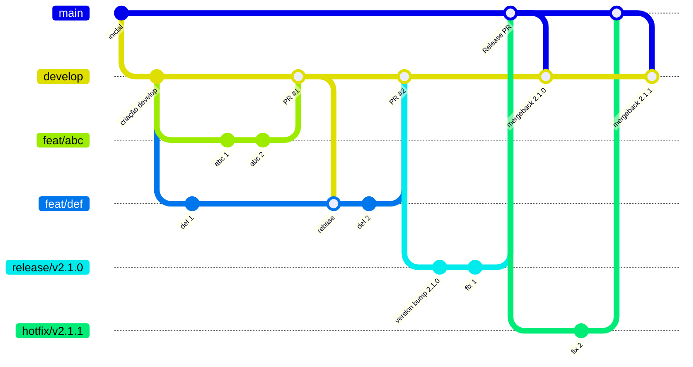

# Banco Imobiliário

Aplicativo para controlar as transações financeiras do jogo Banco Imobiliário. Feito para o
jogador com papel de banqueiro, o app é capaz de configurar partidas do jogo, controlar os jogadores
participantes com seus respectivos saldos, efetuar operações de depósito, saque e transferências,
exibir o histórico de transações e computar o(a) vencedor(a) da partida. Este app não utiliza
recursos de rede, seu armazenamento é complemente local.

O projeto possui os idiomas implementados:

- Inglês (padrão)
- Português Brasil (quando definido no dispositivo)

## Tecnologias Utilizadas

| Nome                                                                                                      | Contexto                                               |
|-----------------------------------------------------------------------------------------------------------|--------------------------------------------------------|
| [JetPack Compose](https://developer.android.com/compose)                                                  | Framework para criação de telas                        |
| [Material Design 3](https://m3.material.io/)                                                              | Design System (Light & Dark modes)                     |
| [Kotlin](https://kotlinlang.org/)                                                                         | Linguagem de programação principal                     |
| [Kotlin Coroutines](https://kotlinlang.org/docs/coroutines-overview.html)                                 | Paralelismo e reatividade                              |
| [Jetpack Navigation](https://developer.android.com/develop/ui/compose/navigation)                         | Navegação entre telas                                  |
| [Room Database](https://developer.android.com/training/data-storage/room)                                 | Armazenamento local SQLite                             |
| [Hilt](https://developer.android.com/training/dependency-injection/hilt-android)                          | Injeção de dependências                                |
| [Android Lint](https://developer.android.com/studio/write/lint)                                           | Análise estática (Android)                             |
| [Detekt](https://detekt.dev/)                                                                             | Análise estática (Kotlin)                              |
| [Sonarqube](https://www.sonarsource.com/products/sonarqube/)                                              | Análise de qualidade de código, segurança e relatórios |
| [KotlinX Kover](https://github.com/Kotlin/kotlinx-kover)                                                  | Cobertura de testes unitários                          |
| [KotlinX Serialization](https://kotlinlang.org/docs/serialization.html)                                   | Conversão de objetos JSON                              |
| [JUnit 4](https://junit.org/junit4/)                                                                      | Execução de testes unitários                           |
| [MockK](https://mockk.io/)                                                                                | Gerenciamento de mocks para testes unitários           | 
| [Turbine](https://github.com/cashapp/turbine)                                                             | Teste de corrotinas e kotlin flows                     |
| [R8 (proguard)](https://developer.android.com/topic/performance/app-optimization/enable-app-optimization) | Ofuscação de código                                    |
| [Google KSP](https://github.com/google/ksp)                                                               | Processamento de anotações                             |
| [Version Catalogs](https://docs.gradle.org/current/userguide/version_catalogs.html)                       | Organização de versões e dependências                  |
| [Github Actions](https://github.com/features/actions?locale=pt-BR)                                        | Workflows de validação e compilação do projeto         |

## Configuração do Projeto

1. Baixe o repositório localmente em sua máquina;
2. Abra a pasta raiz do projeto no [Android Studio](https://developer.android.com/studio?hl=pt-br);
3. Se necessário, realize o download da versão 21 da JDK (`Settings` >
   `Build, Execution, Deployment` > `Build Tools` > `Gradle`);
4. Selecione a build variant `debug` (`Build` > `Select build variant` >
   `:app = debug`);
5. Sincronize o projeto (`File` > `Sync Project with Gradle Files`);
6. Execute o projeto em um dispositivo com o sistema operacional Android 11 ou posterior (`Run` > `Run 'app'`).

## Arquitetura

## Versionamento

O projeto segue a seguinte variante do padrão Git-Flow:

### Papéis das Branches

- **Main**: Contém sempre o código mais atual de produção do app.
- **Develop**: Serve como a branch mais atualizada do projeto, a porta de entrada para funcionalidades novas.
- **Feature branches**: Branches para o desenvolvimento de funcionalidades, correções, melhorias, débitos técnicos. São criadas à partir da `develop` e voltam para ela.
- **Releases**: Branches temporárias criadas para evitar o bloqueio da `develop` enquanto um processo de release está em andamento (testes, análise da google play...). Estas branches servem como um snapshot da develop em determinado momento, representando um "release candidate". São criadas à partir da `develop`, mas são mergeadas na `main`.
- **Hotfixes**: Branches de release destinadas à correções urgentes de produção. São criadas à partir da `main` e voltam diretamente para ela após as correções validadas.

## Templates de Desenvolvimento

Este projeto possui alguns templates de código para facilitar a criação de componentes Compose.
Para utilizá-los em sua IDE, siga os passos abaixo:

1. Acesse o menu `Settings` > `Editor` > `File and Code Templates` do Android Studio.
2. No campo `Scheme`, selecione a opção `Project`, aplique as alterações e clique em Ok.
3. A IDE irá importar os templates disponíveis em `.idea/fileTemplates` automaticamente;
4. Agora, basta testar a importação seguindo os passos:
    - Selecione um diretório de código do projeto
    - Clique com o botão direito do mouse
    - Selecione o menu `New`
    - No submenu, clique em um dos itens customizados, como o `Composable Content`
    - Insira o nome desejado para o componente e verifique o arquivo gerado. 