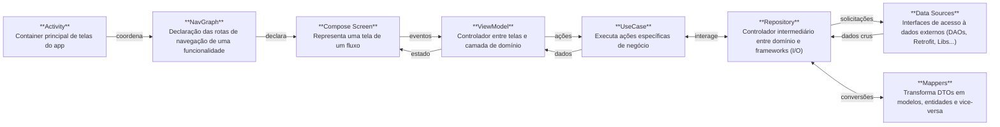

# Arquitetura do App

O projeto segue uma arquitetura baseada em MVVM (Model-View-ViewModel), Jetpack Compose e Kotlin Coroutines e tem como objetivo se manter atualizada com as práticas modernas de desenvolvimento Android incentivadas pela Google.

O fluxo de dados dentro do app é dividido nas camadas abaixo:



## Componentes

### Activity 

Activity padrão do android, a qual é responsável por instanciar e orquestrar os gráfos de navegação/tema do projeto. 

**Exemplo:** [MainActivity.kt](./../app/src/main/java/com/dosei/games/toybank/MainActivity.kt)

### NavGraph

Os componentes `NavGraph` são grafos de navegação do Jetpack Navigation adaptados para o ambiente compose. Nele são definidas as várias rotas de uma funcionalidade específica com suas respectivas telas. Este projeto utiliza um `NavHost` único no módulo `:app`, o qual recebe múltiplos grafos aninhados, provenientes dos módulos de funcionalidades.

**Exemplos:** [AppNavigation.kt](../app/src/main/java/com/dosei/games/toybank/navigation/AppNavigation.kt) (principal), [TransactionNavigation.kt](../features/transaction/src/main/java/com/dosei/games/toybank/transaction/navigation/TransactionNavigation.kt)  (funcionalidade)

### Screen (Composables)

Uma `Screen` representa uma tela específica de uma funcionalidade. Elas são responsáveis por organizar os componentes visuais (widgets), configurar animações e tratar eventos do usuário, enviando-os aos `ViewModels`.

**Exemplo:**
```kotlin
// O arquivo Scren é composto por vários elementos

// 1. Função Screen principal (também conhecida como 'Loader')
// é chamada nos NavGraphs e lida com tudo que depende de tempo de execução (rotinas que impedem os previews).
@Composable
internal fun HistoryScreen(
    controller: NavHostController,
    viewModel: HistoryViewModel,
) {
    // Observa estados de viewModel
    val history by remember { viewModel.fetchHistory() }.collectAsState()

    // Delega eventos...
    val actions = remember {
        HistoryActions(
            onBack = { controller.popBackStack() },
            onClickItem = { viewModel.onClickItem(it) }
        )
    }

    HistoryContent(
        history = history,
        actions = actions
    )
}

// 2. Action objects
// São data classes que contém as lambdas de todas as ações disponíveis nessa tela, como cliques, atualização de textos, gestos...
private data class HistoryActions(
    val onBack: () -> Unit = {},
)

// 3. Content function
// Declara o conteúdo da tela em si, é independente de runtime. Possibilita os previews limpos.
@OptIn(ExperimentalMaterial3Api::class)
@Composable
private fun HistoryContent(
    history: List<HistoryEntry>,
    actions: HistoryActions,
) {
    Scaffold(
        topBar = { TopAppBar(/* ... */) }
    ) { innerPadding ->
        LazyColumn(
            modifier = Modifier
                .padding(innerPadding)
                .fillMaxSize()
        ) { /* ... */ }
    }
}

// 4. Preview functions (uma ou mais)
// São as funções de pré-visualização do Compose, possibilitam a rápida identificação das telas durante o desenvolvimento/manutenção e podem exemplificar várias combinações diferentes de estado.
@Preview(showBackground = true)
@Composable
private fun Preview() {
    Surface(modifier = Modifier.fillMaxSize(), color = Color.White) {
        HistoryContent(
            history = listOf(
                HistoryEntry.Deposit(25000, Date(), Player(name = "Oliver")),
                HistoryEntry.Withdraw(30000, Date(), Player(name = "Jeniffer")),
                HistoryEntry.Transfer(
                    amount = 45000,
                    date = Date(),
                    sourcePlayer = Player(name = "Robert"),
                    destinationPlayer = Player(name = "Lucy")
                ),
            ),
            actions = HistoryActions()
        )
    }
}

@Preview(showBackground = true)
@Composable
private fun PreviewEmpty() {
    Surface(modifier = Modifier.fillMaxSize(), color = Color.White) {
        HistoryContent(
            history = listOf(),
            actions = HistoryActions()
        )
    }
}
```

### ViewModel

Os `ViewModels` são controladores que agem entre a tela e a camada de dados do app. Seu objetivo é fornecer um estado para a tela basear-se e tratar seus eventos. Os `viewModels` podem se comunicar diretamente tanto com `UseCases` quanto `Repositories`.

**Exemplo:** [NewGameViewModel.kt](../features/newgame/src/main/java/com/dosei/games/toybank/newgame/presentation/NewGameViewModel.kt)

### UseCase

Os `UseCases` representam ações de negócio específicas que o usuário pode realizar dentro do app, são objetos que conhecem regras de negócio e são independentes de frameworks/telas.

**Exemplos:** [CheckGameState](../core/src/main/java/com/dosei/games/toybank/core/data/usecase/CheckGameState.kt), [PerformTransaction](../features/transaction/src/main/java/com/dosei/games/toybank/transaction/data/usecase/PerformTransaction.kt).

### Repository

Os repositórios são classes exclusivas da camada de dados do app, elas fazem o intermédio entre rotinas internas e sistemas/frameworks externos, como bancos de dados, APIs REST, bibliotecas do firebase... buscando e sincronizando dados/ações. 

**Exemplos:** [PlayerRepository](../core/src/main/java/com/dosei/games/toybank/core/data/repository/PlayerRepository.kt), [TransactionRepository](../core/src/main/java/com/dosei/games/toybank/core/data/repository/TransactionRepository.kt).

### Mappers

Os `mappers` são extension functions de apoio utilizadas para transformar objetos entre as camadas de arquitetura e assim, evitar acoplamentos indevidos ou entidades internas com estados inválidos em fluxos críticos. Geralmente são usados nos `repositories` ou `useCases`.

**Exemplo:** [HistoryEntryMappers](../features/history/src/main/java/com/dosei/games/toybank/history/data/mapper/HistoryEntryMappers.kt).

### Data Sources

As "fontes de dados" são abstrações que normalmente delegam solicitações de dados e ações sistemas externos ao app (I/O), como os DAOs do Room database, as APIs do Retrofit, Remote Config ou Raaltime Database do Firebase...

**Exemplos:** [PlayerDao](../core/src/main/java/com/dosei/games/toybank/core/data/storage/player/PlayerDao.kt), [TransactionDao](../core/src/main/java/com/dosei/games/toybank/core/data/storage/transaction/TransactionDao.kt).

## Modularização

Para otimizar a compilação do projeto, a modularização por funcionalidade foi definida, seguindo o padrão abaixo: 

```txt
:app            Responsável por orquestrar todas as funcionalidades e inicializar o app.
:core           Recursos comuns à todas as funcionalidades, como armazenamento centralizado, sessão...
:ui             Módulo destinado ao design system, define tema, cores e tipografia e customizações.
:commons        Componentes compartilhados que são dependentes de modelos de negócio (core + ui).
:test           Utilidades para testes unitários (pode ser importado como `testImplementation`)
:features:abc   Módulo da funcionalidade ABC
:features:def   Módulo da funcionalidade DEF
:features:ghi   Módulo da funcionalidade GHI
```

## Referências

- [Guia para arquitetura Android](https://developer.android.com/topic/architecture?hl=pt-br)
- [Exemplos oficiais Android](https://github.com/android/architecture-samples)