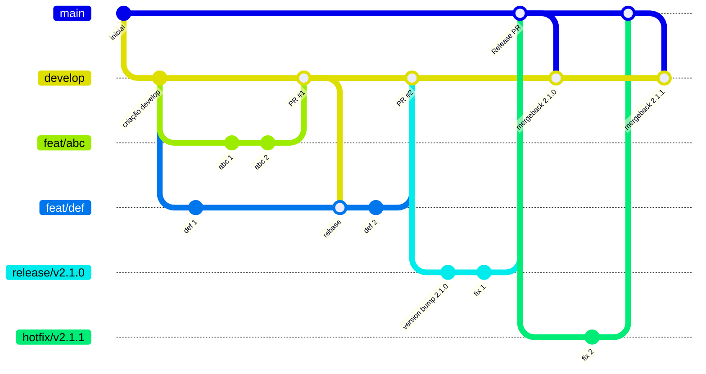

## Versionamento

O projeto segue a seguinte variante do padrão Git-Flow:

### Papéis das Branches

#### Main
Contém sempre o código mais atual de produção do app.

#### Develop
Serve como a branch mais atualizada do projeto, a porta de entrada para funcionalidades novas.

#### Feature branches
Branches para o desenvolvimento de funcionalidades, correções, melhorias, débitos técnicos. São criadas à partir da `develop` e voltam para ela. Padrão de nomenclatura: `feature/descricao`, `debt/descricao`, `refactor/descricao`, `bugfix/descricao`...

#### Releases
Branches temporárias criadas para evitar o bloqueio da `develop` enquanto um processo de release está em andamento (testes, análise da google play...). Estas branches servem como um snapshot da develop em determinado momento, representando um "release candidate". São criadas à partir da `develop`, mas são mergeadas na `main`. O padrão utilizado para versões do app é o [Semantic Versioning (SemVer)](https://semver.org/lang/pt-BR/). Padrão de nomenclatura: `release/vX.Y.Z`.

#### Hotfixes
Branches de release destinadas à correções urgentes de produção. São criadas à partir da `main` e voltam diretamente para ela após as correções validadas.
